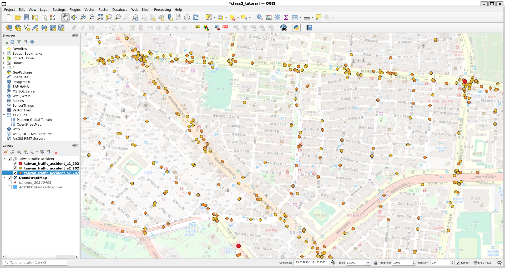
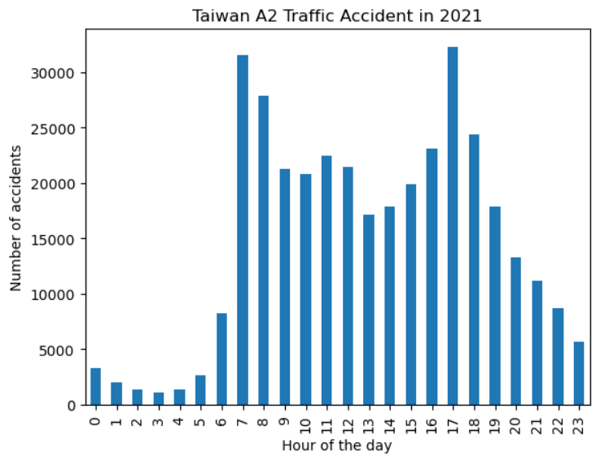

# Traffic Accident Analysis for Providing Safer Commute Routes

Dataset used can be found [here](https://data.gov.tw/en/datasets/12197).

The datasets provide data on the occurrence time, location, number of casualties, and types of vehicles involved in Category A1 and A2 traffic accidents from 2013 to 2021. Category A1 refers to traffic accidents that cause death on the spot or within 24 hours, while Category A2 refers to traffic accidents that cause injury or death in more than 24 hours.

The datasets are useful for our project titled “Commute Convoying” as it provides both the location and time of each accident, therefore we can pick a safer route and time when convoying children or elders. It provides the exact location of the accident by giving the geographic coordinate, and it also gives the time that occurred, accurate to the second, which means that we can prevent the peak time when convoying them.

For the location of the accidents, we can use “QGIS” to locate all the accidents. The image below describes the number of accidents that occurred. Each small dot describes a Category A2 accident that happened in that location, while the big dot describes the Category A1 accident.

For the time it occurred, we can use “pandas” to analyse the data. One of the examples that we can analyse the data is by showing the results of total accidents by hours of the day. In this case, we can find that around 7:00 and 17:00 had the most accidents in 2021.

To conclude, the datasets provide perfect data for finding safer commute routes for children and elders. It can not only give safer routes, but also a better time when picking a route.
